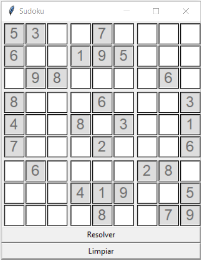
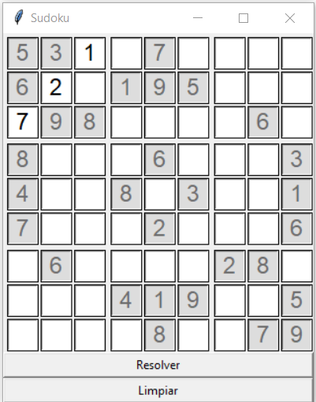

# Resolutor de Sudoku en Python

## Descripción
Esta aplicación en Python permite **resolver un Sudoku introducido manualmente por el usuario** mediante una interfaz gráfica. El programa valida el tablero antes de intentar resolverlo y muestra mensajes claros tanto en caso de error como cuando el Sudoku se resuelve correctamente.

El resolutor utiliza un **algoritmo de backtracking**, garantizando que la solución respete todas las reglas del Sudoku. El proyecto está orientado a la práctica de lógica, algoritmos y desarrollo de interfaces gráficas en Python.

## Características
- Introducción manual de Sudokus en una cuadrícula de 9×9.
- Resolución automática mediante algoritmo de **backtracking**.
- Validación del tablero antes de resolver:
  - Detecta Sudokus inválidos.
  - Muestra mensajes de error de forma amigable.
- Mensaje de éxito cuando el Sudoku se resuelve correctamente.
- Separación visual clara de los bloques 3×3.
- Botón **Limpiar** para reiniciar el tablero.
- Interfaz gráfica sencilla e intuitiva.

## Capturas de la interfaz



## Cómo usar
1. Ejecuta el archivo principal con Python 3:
```bash
python sudoku.py
```
2. Introduce los números del Sudoku (del 1 al 9).  
3. Pulsa el botón **Resolver** para obtener la solución.  
4. Usa **Limpiar** si quieres introducir un nuevo Sudoku.

## Licencia
Este proyecto está bajo la licencia MIT. Consulta el archivo [LICENSE](LICENSE) para más detalles.

## Autor
Josu Ramos
